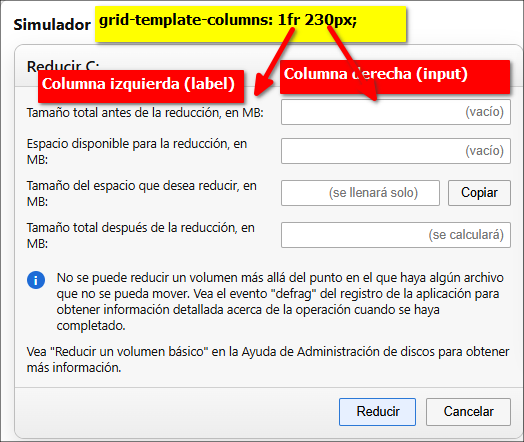
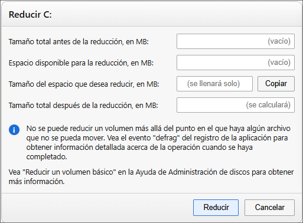
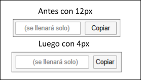
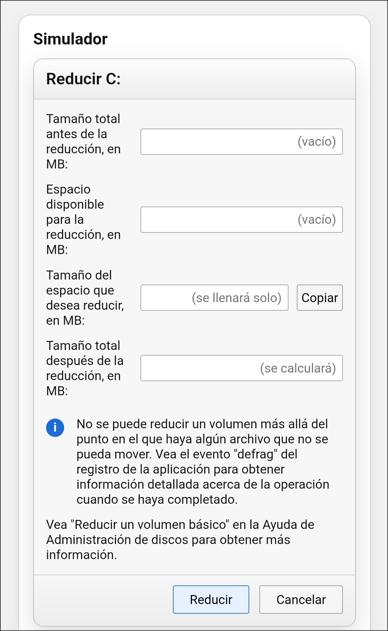

# Problema en el Simulador, mucho espacio en input afecta el texto de label

Tengo un problema, en el "Simulador" el primer valor:

Tamaño total antes de la reducción, en MB:

está en una sola línea, pero el segundo valor está así:

Espacio disponible para la reducción, 
en MB:

esto es porque está así:

```css
.winRow{
  display:grid;
  grid-template-columns: 1fr 230px;
  gap:10px;
  align-items:center;
}
```





y para solucionarlo le pongo en el input "200px":

```css
.winRow{
  display:grid;
  grid-template-columns: 1fr 200px;
  gap:10px;
  align-items:center;
}
```

y queda así:




# Reduciendo el tamaño del ancho del botón "Copiar"

Para hacer que ocupe menos, al botón "Copiar" mejor lo dejo así:

```css
.winBtn--copy{
  height:26px;
  padding:0 4px;   /* antes era 12px */
  font-size:12.5px;
  white-space:nowrap;
}
```

y queda así:




# Solución a label recogido en celulares

En los celulares, label se recoge, como se ve en la siguiente imagen:



Para solucionarlo, hay que hacer que se ponga encima de input, para esto añadiré al final del archivo lo siguiente:

```css
/* ===== Mobile: labels arriba, inputs abajo ===== */
@media (max-width: 520px){
  .winRow{
    grid-template-columns: 1fr;   /* una sola columna */
    gap: 6px;                     /* menos espacio vertical */
    align-items: start;
  }

  .winLabel{
    margin-top: 4px;
  }

  /* La celda derecha (input) ocupa todo el ancho */
  .winInput{
    width: 100%;
  }

  /* Fila que tiene input + botón Copiar */
  .winField{
    width: 100%;
  }

  /* Opcional: que el input + botón se acomoden mejor */
  .winField{
    display: grid;
    grid-template-columns: 1fr auto;
    gap: 8px;
    align-items: center;
  }

  /* Para que el input no se haga gigantesco verticalmente */
  .winBtn--copy{
    justify-self: end;
  }
}
```

**¿Qué hace esto?**

- En móvil, cada fila pasa de: **[label | input]**
  a: **label arriba + input debajo**
- En la fila del botón “Copiar”, deja: **input y botón** en la misma línea, bien acomodados.


