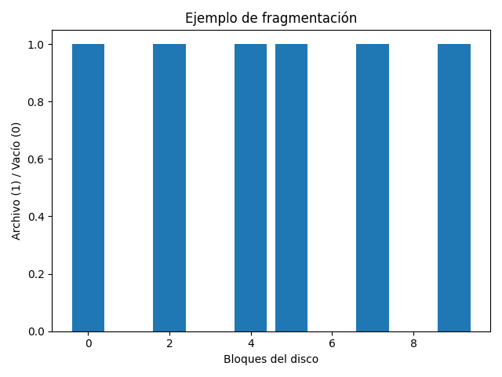

# Fragmentación y Desfragmentación en Windows

## ¿Qué es la fragmentación?

La fragmentación ocurre cuando un archivo se divide en múltiples partes no contiguas dentro del disco.

Ejemplo ilustrativo:

Los bloques marcados como "1" representan partes de un mismo archivo separadas físicamente.

## ¿Por qué afecta la reducción de volumen?

Windows no puede reducir una partición más allá del último bloque ocupado por un archivo no movible.

Si un archivo del sistema está ubicado cerca del final del disco:

→ Ese bloque se convierte en el límite máximo reducible.

## Archivos que no se pueden mover fácilmente

- pagefile.sys
- hiberfil.sys
- MFT (Master File Table)
- Metadatos NTFS

## ¿Qué hace la desfragmentación?

La desfragmentación:

1. Reordena bloques contiguos.
2. Intenta mover archivos hacia el inicio del disco.
3. Libera espacio continuo al final.

Después de desfragmentar, el valor "Espacio disponible para la reducción" puede aumentar.

## Nota importante

En SSD modernos, Windows no realiza desfragmentación tradicional, sino optimización TRIM.

---

Este documento complementa la explicación matemática del simulador.
