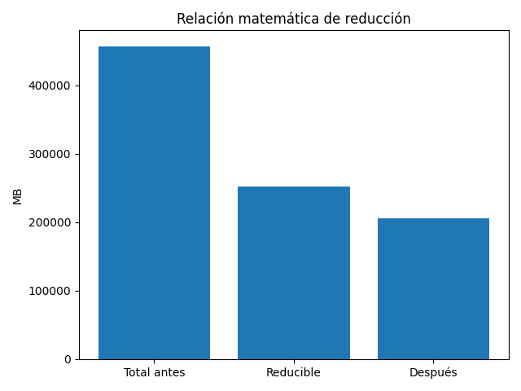
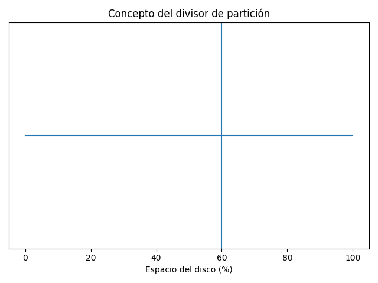

# Matemática y Lógica Interna del Simulador

## 1. Variables principales

- T = Tamaño total antes de la reducción (MB)
- A = Espacio disponible para la reducción (MB)
- R = Tamaño que se desea reducir (MB)
- D = Tamaño después de la reducción (MB)

## 2. Fórmulas utilizadas

### Límite máximo permitido:
R ≤ A

### Cálculo del tamaño final:
D = T - R

### Validación:
0 ≤ R ≤ A

## 3. Representación gráfica



## 4. Lógica del divisor

El divisor representa visualmente el valor R.

Matemáticamente:

posición_divisor (%) = (R / T) × 100



## 5. Lógica del código (JavaScript)

### Cálculo principal:

```javascript
const total = Number(totalInput.value);
const available = Number(availableInput.value);

const maxReducible = available;

if (desired > maxReducible) desired = maxReducible;

const after = total - desired;
```

### Movimiento del divisor:

El divisor calcula el porcentaje según la posición del mouse y lo convierte a MB proporcionalmente al tamaño total.

---

Este archivo está dirigido a desarrolladores que deseen modificar la lógica matemática del simulador.
